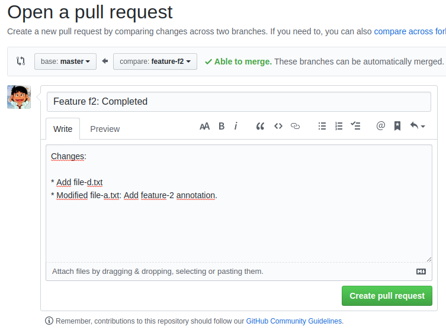

#### Máster Cloud Apps Módulo IV - DevOps, integración y despliegue continuo

# Práctica: Repositorios y modelos de desarrollo 

## 2. Trunk-based development

Se inicia el repositorio y se sicroniza con el remoto:

```console
git init
git remote add origin git@github.com:mscarceller/m.sorianoc.2019-tbd.git
```

Se inicia el desarrollo de la funcionalidad f1:

Para la primera feature haremos los commits directamente a master:

* Creamos los 3 commits:

```console
echo "Feature 1: This is the 'a' file" > file-a.txt
git add .
git commit -m "feature f1: Add file 'a' in feature-f1"
git push origin master
```

```console
echo "Feature 1: This is the 'b' file" > file-b.txt
git add .
git commit -m "feature f1: Add file 'b' in feature-f1"
git push origin master
```

```console
echo "Feature 1: This is the 'c' file" > file-c.txt
git add .
git commit -m "feature f1: Add file 'c' in feature-f1"
git push origin master
```


En este punto vamos a sacar la release 1.0

 * Creamos la rama de relaese:

```console
git checkout -b release/1.0
```

 * Creamos el tag de la release:

```console
git tag "v1.0"
```

* Hacemos el push de la rama de release y de la tag:

```console
git push origin release/1.0
git push --tags
```

##  YA TENEMOS LA RELEASE v1.0  

En este momento comenzamos el desarrollo de las f2 y f2. Para ello clonamos el repo en otra carpeta, en la que creamos la feature-f3:

* En la carpeta original:

```console
git checkout -b feature-f2
```

* En la nueva carpeta:

```console
git checkout -b feature-f3
```

Se añade el nuevo fichero en la funcionalidad f2 y se hace commit:

```console
echo "This is the 'd' file" > file-d.txt
git add .
git commit -m "Add file 'd' in feature-f2"
```

Se modifica el fichero "a" en la funcionalidad f2 y se hace commit:

```console
echo -e "f2 - $(cat file-a.txt)" > file-a.txt 
git add .
git commit -m "Modify file 'a' with feature-f2 annotation"
```

Se sube al repositorio remoto:

```console
git push -u origin feature-f2
```

Se resuleve la pull request haciendo **squash and merge** y borrando la rama:

* Vemos la pull request en el repositorio remoto:


* Añadimos la información para el resto del equipo:



* Se resuleve la pull request haciendo **squash and merge**:


* Finalmente eliminamos la rama:


Actualizamos nuestra rama master:

```console
git checkout master
git pull --rebase origin master
```

En este punto vamos a sacar la release 2.0

* Creamos la rama de relaese:

```console
git checkout -b release/2.0
```

* Creamos el tag de la release:
```console
git tag "v2.0"
```

* Hacemos el push de la rama de release y de la tag:

```console
git push origin release/2.0
git push --tags
```

## AQUI YA TENEMOS LA REALESE 2.0

Se notifica una incidencia (bug) en producción, y se
desarrolla un hotfix consistente en añadir el fichero f al repositorio:

```console
echo "This is the 'f' file to fix the bug" > file-f.txt
git add .
git commit -m "Bugfix: Add file 'f' to resolve bug xxxxxx"
git push origin master
```

Aplicamos la solución del bug, mediante cherry-pick, tageamos y subimos los cambios al repo remoto:

```console
git checkout release/2.0
git cherry-pick df2f928
git tag "v2.1"
git push origin release/2.0
git push --tags
```

## AHORA TENDRIAMOS EL BUG SOLUCIONADO BAJO LA TAG 2.1 **

Seguimos trabajando en f3

Se crea el fichero file-e.txt:

```console
echo "This is the 'e' file" > file-e.txt
git add .
git commit -m "Add file 'e' in feature-f3"
```

Se modifica el fichero "a" en la funcionalidad f3 y se hace commit y se sube al repositorio remoto:

```console
echo -e "$(cat file-a.txt) - f3" > file-a.txt 
git add .
git commit -m "Modify file 'a' with feature-f3 annotation"
```

Hago un pull de master con rebase, para mantener mi repo actualzado antes de pusheralo al remoto y aparece el conflicto:

```console
<<<<<<< HEAD
f2 - Feature 1: This is the 'a' file
=======
Feature 1: This is the 'a' file - f3
>>>>>>> Modify file 'a' with feature-f3 annotation
```

Resolvemos este conflicto dejando solo la linea:

```console
"This is the 'a' file with f2 anf f3 conflict solved"
```

```console
git add file-a.txt
git rebase --continue
```

Ahora podemos empujar la feature-f3 al repositorio remoto:

```console
git push -u origin feature-f3
```

Se resuleve la pull request haciendo squash and merge del mismo modo que se hizo con la feature2.

Actualizamos nuestra rama master:

```console
git checkout master
git pull --rebase origin master
```

En este punto vamos a sacar la release 3.0:

*  la rama de relaese:

```console
git checkout -b release/3.0
```

* Creamos el tag de la release:

```console
git tag "v3.0"
```

* Hacemos el push de la rama de release y de la tag:

```console
git push origin release/3.0
git push --tags
```

## AQUI YA TENEMOS LA REALESE 3.0


